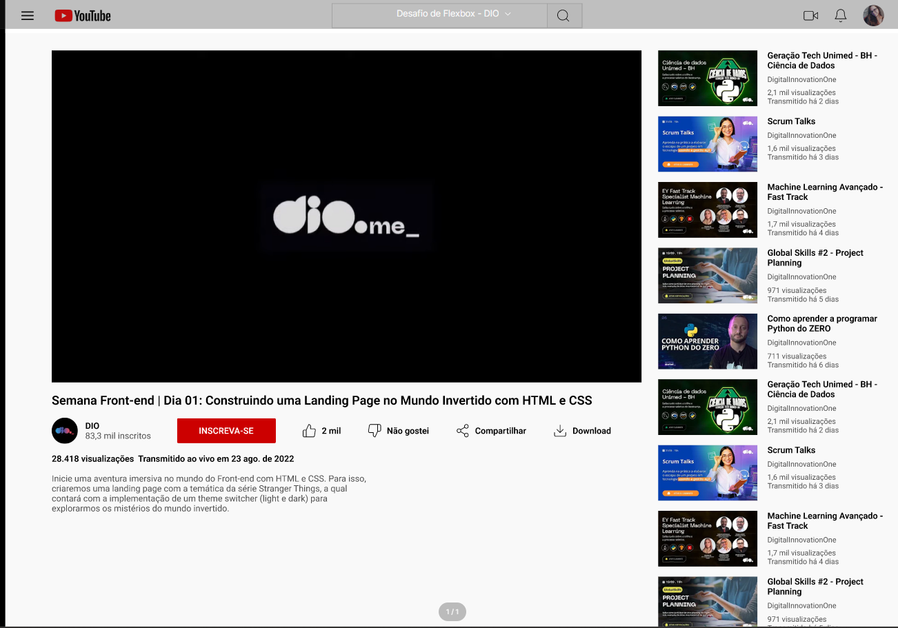

# 📺 Clone do YouTube - Desafio DIO Santander

Este repositório contém o projeto desenvolvido como parte do desafio do **Bootcamp Santander 2024 - Fullstack Developer** oferecido pela **[DIO - Digital Innovation One](https://www.dio.me/)**. O objetivo foi recriar a interface da página de visualização de vídeo do YouTube utilizando **HTML** e **CSS**.

## 🔨 Tecnologias Utilizadas

- HTML5
- CSS3
- Flexbox
- Google Fonts
- Responsividade básica

## 📌 Desafio

O desafio proposto foi construir uma **página de vídeo do YouTube**, contendo:

- ✅ Um vídeo em destaque no centro da tela
- ✅ Informações do vídeo (título, visualizações, botão de like e dislike, etc)
- ✅ Lista de vídeos recomendados na lateral
- ✅ Estilização fiel ao layout original

## 💻 Layout Proposto

O layout foi inspirado na interface oficial do YouTube, focando na estrutura da página de reprodução de vídeo.



## 🧠 Aprendizados

Durante o desenvolvimento desse projeto, aprofundei meus conhecimentos em:

- Estruturação de layouts com HTML semântico

- Uso de Flexbox para organização dos elementos

- Posicionamento e espaçamento de conteúdo

- Práticas de organização de código CSS

## 🚀 Como executar

1. Clone o repositório:
```bash
git clone https://github.com/seu-usuario/clone-youtube-dio.git